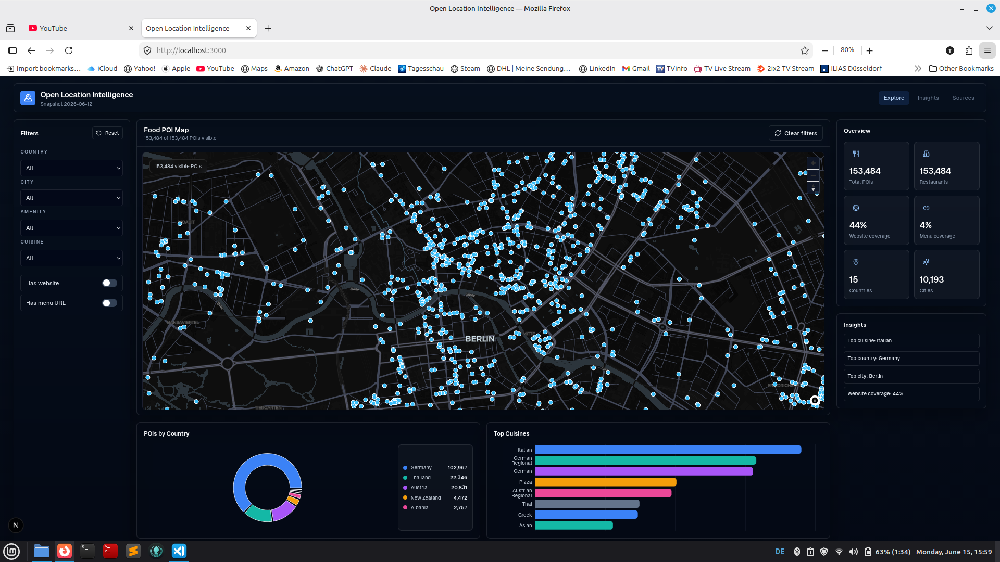
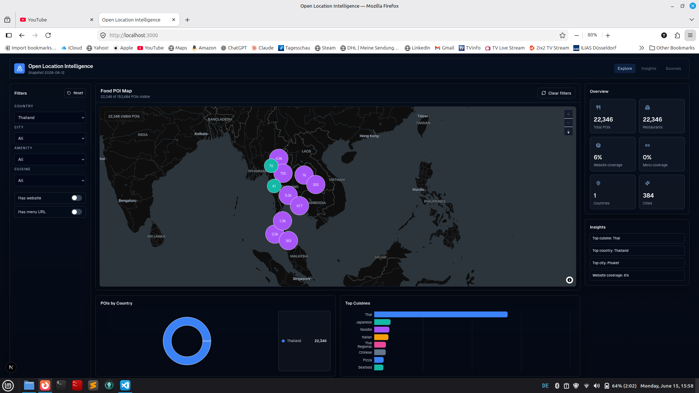

# OpenLI - Open Location Intelligence

**A geospatial restaurant intelligence MVP that turns OpenStreetMap POIs into analytics-ready datasets and an interactive map dashboard.**


OSM ETL · Data normalization · Data analytics · Next.js dashboard · MapLibre visualization

OpenLI is a local-first data engineering and analytics project for restaurant intelligence. It extracts restaurant POIs from public OpenStreetMap country snapshots, normalizes messy OSM tags into stable analytical fields, writes snapshot-based Parquet datasets, and visualizes the result in a modern map-first web dashboard.

## Preview



**Berlin restaurant intelligence:** cuisine distribution, map clusters, and website/menu coverage in a dark-mode analytics dashboard.



**Thailand restaurant intelligence:** country-level restaurant patterns with MapLibre, KPI cards, and cuisine charts.

## What OpenLI Does

OpenLI builds the first step of a restaurant analytics data product:

- Downloads Geofabrik `.osm.pbf` country extracts.
- Extracts OpenStreetMap POIs with `amenity=restaurant`.
- Normalizes raw OSM fields such as cuisine values into analytics-friendly columns.
- Writes dated and `latest` Parquet snapshots for reproducible analysis.
- Serves local Parquet snapshots to a map-centric Next.js dashboard.

The snapshot design makes the data ready for future time-based comparisons, such as tracking how Vietnamese restaurants change across Berlin districts over multiple OSM snapshots.

## Example Insights

Sample insights from current local snapshots:

- In Berlin, Italian restaurants are currently the most common cuisine, followed by Vietnamese.
- Berlin has about **65% website coverage**, compared with about **53% for Germany overall**.
- In New Zealand, Indian cuisine is the leading restaurant category, followed by Chinese cuisine.
- In Thailand, Thai cuisine dominates the restaurant dataset.

## Tech Stack

**Data Engineering**

- Python ETL for local `.osm.pbf` processing
- `pyosmium`, `pandas`, `pyarrow`, `tqdm`
- Parquet snapshots for efficient local analytics

**Dashboard**

- Next.js, React, TypeScript
- Tailwind CSS with shadcn/ui-style components
- MapLibre GL JS for interactive maps
- Recharts for dashboard charts

**Data Source**

- OpenStreetMap data via Geofabrik country extracts

## Architecture

```text
Geofabrik .osm.pbf
     -> Python ETL
     -> Data normalization
     -> Parquet snapshots
     -> Next.js API
     -> Restaurant Intelligence Dashboard
```

Raw OSM extracts and generated Parquet files are local artifacts and are intentionally not committed to Git.

## Quick Start

Create the Python environment and generate a small test snapshot:

```bash
python -m venv .venv
.venv/bin/python -m pip install -r requirements.txt
./etl.sh --country germany --max-extract 100
```

Start the dashboard:

```bash
cd dashboard
npm install
npm run dev
```

Open:

```text
http://localhost:3000
```

The dashboard reads all latest Parquet snapshots from:

```text
data/processed/*_snapshot_latest.parquet
```

## Run The Full ETL

The main ETL entry point is:

```bash
./etl.sh
```

Countries are configured in:

```text
etl/config/geofabrik_countries.tsv
```

Useful commands:

```bash
# Run all configured countries sequentially
./etl.sh

# Run one country
./etl.sh --country germany

# Preview planned downloads and extraction commands
./etl.sh --dry-run --country germany

# Force a fresh download even if the raw file already exists
./etl.sh --country germany --force

# Extract only a small sample for development
./etl.sh --country germany --max-extract 100

# Run multiple country jobs in parallel
./etl.sh --parallel 3
```

See [docs/etl.md](docs/etl.md) for detailed ETL usage, output columns, progress bars, and scaling notes.

## Project Structure

```text
openli/
  data/                 # local raw OSM extracts and generated Parquet snapshots
  docs/                 # ETL documentation and scaling notes
  etl/                  # reusable Python ETL package and scripts
  dashboard/            # Next.js restaurant intelligence dashboard
  screenshot/           # dashboard screenshots for documentation
```

## Data Model Highlights

Each restaurant snapshot is written as Parquet and includes stable fields for analytics:

- OSM identity: `osm_id`, `osm_type`
- Restaurant metadata: `name`, `amenity`, `brand`, `operator`
- Address and location: street, postcode, city, country, `lat`, `lon`
- Geometry: WKB geometry in EPSG:4326 for later geospatial workflows
- Raw cuisine value: `cuisine`
- Normalized cuisine fields: tokens, primary cuisine, type, country mapping
- Snapshot metadata: source file, extraction timestamp, snapshot date

The ETL also writes a summary JSON next to each Parquet file with counts and data quality metrics.

## Dashboard Features

- Clustered MapLibre map for restaurant POIs.
- Filters for country, city, amenity, cuisine, website, and menu URL.
- KPI cards for total restaurants, website coverage, menu coverage, countries, and cities.
- Charts for country distribution and top cuisines.
- Deterministic insights based on the currently filtered data.
- Local API route that reads latest Parquet snapshots without requiring a database.

For dashboard-specific setup notes, see [dashboard/README.md](dashboard/README.md).

## Why This Project Matters

OpenLI demonstrates an end-to-end geospatial data product:

- Efficient local processing of large OSM `.osm.pbf` files.
- Columnar data modeling for fast analytical workflows.
- Practical normalization of messy, real-world volunteered geographic information.
- Map-first product thinking with a modern React dashboard.
- A privacy-conscious local workflow without authentication, payments, analytics tracking, or a required database.

## Roadmap

- Enrich restaurants with districts, neighborhoods, and administrative boundaries.
- Add DuckDB-based exploration workflows for local analytics.
- Add a PostGIS path for larger spatial joins and production serving.
- Support more POI categories such as cafes, bars, pubs, fast food, and biergartens.
- Compare historical snapshots to detect restaurant openings, closings, and cuisine shifts.
- Publish a small sample dataset or hosted demo for easier evaluation.

## Data Source And License Notes

OpenLI uses OpenStreetMap data via Geofabrik extracts. Please respect the OpenStreetMap license and attribution requirements when using derived data.

- Data source: [OpenStreetMap](https://www.openstreetmap.org/)
- Extract provider: [Geofabrik Downloads](https://download.geofabrik.de/)
- Raw `.osm.pbf` files and generated Parquet snapshots are not committed to this repository.
- Repository license: to be added before broader reuse.
